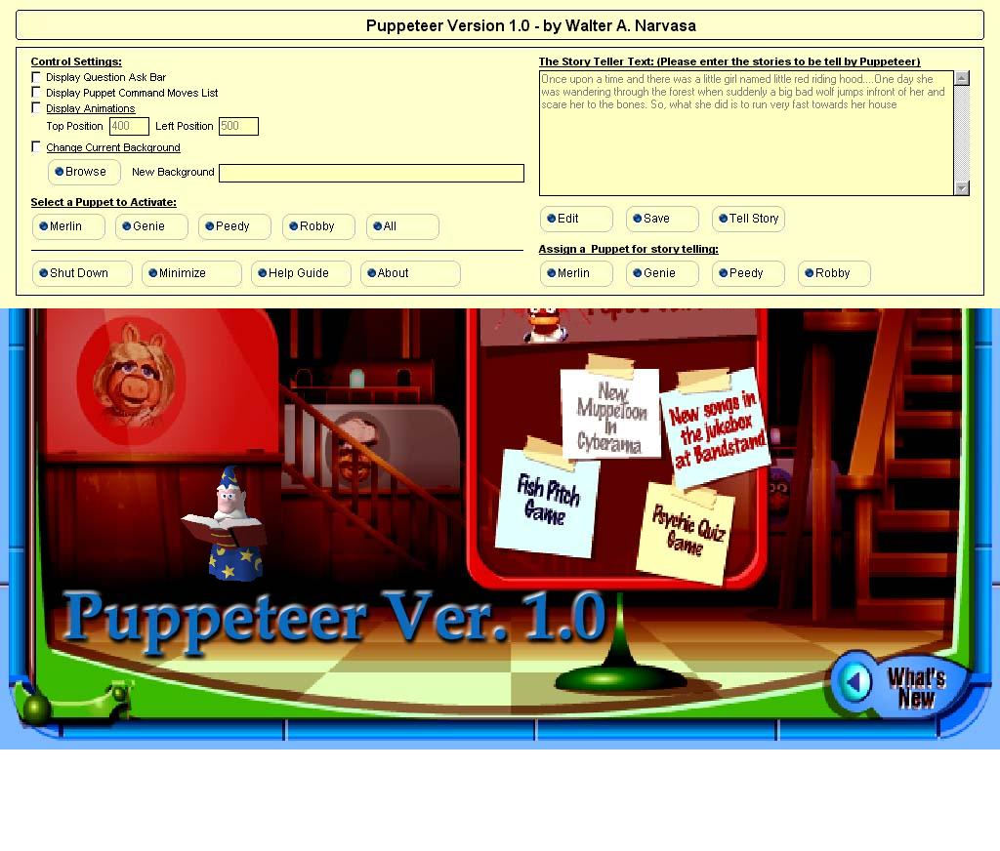



## PUPPETEER VER\. 1\.0 \(a complete AI storyteller puppet that can have a conversation with human\)

### Description

One of the best code that i developed for the purpose of children entertainment. In this code you will see another "Cool GUI Vertical Menu" that can be scrolled vertically by using your mouse, etc. And this Puppet can read a story, actions/commands, and have a conversation with human by asking the Puppet with some questions. This is actually the 2nd version of my Smart Artificial Intelligence that i have sent. PLEASE VOTE FOR THIS CODE AND HAVE FUN WITH IT.
 
### More Info
 

             |
---                |---
**Submitted On**   |2001-02-05 04:28:00
**By**             |[Walter Narvasa](https://github.com/Planet-Source-Code/PSCIndex/blob/master/ByAuthor/walter-narvasa.md)
**Level**          |Advanced
**User Rating**    |4.8 (100 globes from 21 users)
**Compatibility**  |VB 6\.0
**Category**       |[Games](https://github.com/Planet-Source-Code/PSCIndex/blob/master/ByCategory/games__1-38.md)
**World**          |[Visual Basic](https://github.com/Planet-Source-Code/PSCIndex/blob/master/ByWorld/visual-basic.md)
**Archive File**   |[CODE\_UPLOAD14532242001\.zip](https://github.com/Planet-Source-Code/walter-narvasa-puppeteer-ver-1-0-a-complete-ai-storyteller-puppet-that-can-have-a-conversa__1-15014/archive/master.zip)

